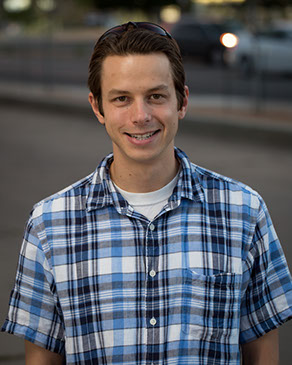
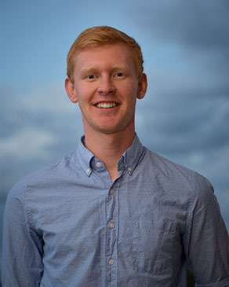
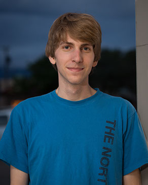

# Class of 2014

### Erin Carrier

University of Illinois Urbana-Champaign

Department of Computer Science

Advisor: Luke Olson

Erin is in the scientific computing research group at the University of Illinois.  She is interested in general numerical analysis and high performance computing.

### Ken Czuprynski

University of Iowa

Department of Applied Mathematics

Advisor: Weimin Han

Ken is currently a fourth year graduate student at the University of Iowa studying Applied Mathematics. Broadly, his research focuses on Differential Equations / Numerical Analysis and their application to problems in Biomedical Imaging. More specifically, Ken has been working with the Radiative Transfer Equation investigating existence and uniqueness under varying assumptions, as well as the development of numerical algorithms.

### Robert Pavel

University of Delaware

Department of Electrical and Computer Engineering

Advisor: Guang R Gao

Robert received his undergraduate degree in Computer Engineering at the University of Delaware in 2010. His research interests include the optimization of code and algorithms for novel architectures, and program execution models. Robert's thesis topic is the development of tools to utilize parallel discrete event simulation in the study and design of computer architectures and program execution models for exascale computing.

### Pascal Grosset

University of Utah

School of Computing

Advisor: Charles Hanson

Pascal's areas of interest are visualization and, high performance computing. For his PhD work, Pascal collaborates with chemical engineers who work on clean coal combustion. They run large simulations on clusters to simulate burning of pulverized coal at high temperatures. This generates huge amounts of time varying data which are usually too big to comprehend in their raw form. Pascal's research aids in the visualization of these data by investigating new volume rendering algorithms that speed up the rendering and composting process on clusters.

### Robert Bird

 University of Warwick

 Department of Computer Science

 Advisor: Stephen Jarvis

  Robert is a PhD student in the High Performance & Scientific Computing group at the University of Warwick. His research focuses on developing novel techniques to facilitate effective use of future compute hardware. As the prominence of heterogeneous computing platforms increase, so too does the disparity between achieved and theoretical peak performance for many scientific codes. His work aims to address this gap, by providing a set of techniques to offer portable performance to legacy codes.

### Andrew Reisner

University of Illinois Urbana-Champaign

Department of Computer Science

Advisor: Luke Olson

Andrew is a student in the Scientific Computing group at the University of Illinois. He has a general interest in multigrid methods for applications with a focus on performance.

