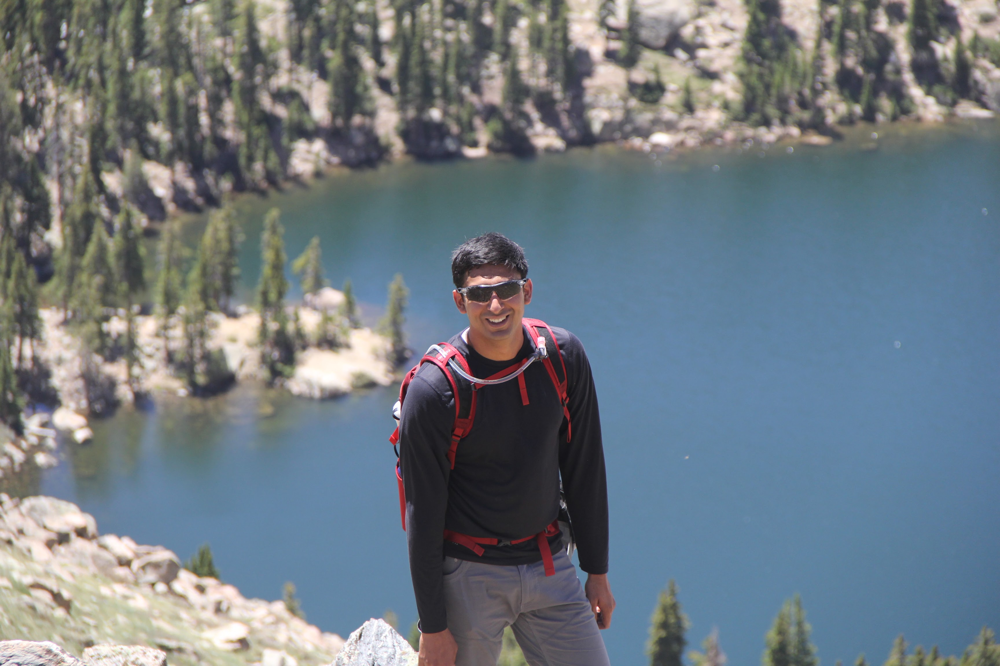
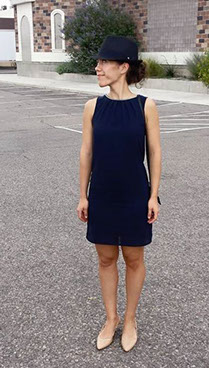
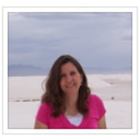
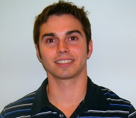

# Summer School Leads

### Robert Pavel

CCS-7 Applied Computer Science

Robert is a computational scientist with a background in electrical and computer engineering. He has experience in improving the performance of multi-scale physics applications through the use of task based models and NoSQL databases. His interests include evaluating the suitability of modern task based programming models with respect to scientific applications.

Robert is an alumnus of the 2013 and 2014 summer school classes

### Vinay Ramakrishnaiah

CCS-7 Applied Computer Science

Vinay is a postdoctoral research associate with a background in Electrical and Computer Engineering. He has experience in programming heterogeneous computer systems and is also skilled in antenna theory, signal processing, and optimizations. His research interests include revamping the coherent collection process in time-evolving satellite collector geometries, and also developing and evaluating applications for emerging hardware architectures.

Vinay is an alumnus of the 2017 summer school class.

# Summer School Mentors

### Reid Priedhorsky

HPC-ENV HPC Environments

Reid is a staff scientist at Los Alamos National Laboratory. Prior to Los Alamos, he was a research staff member at IBM Research. He holds a Ph.D. in computer science from the University of Minnesota and a B.A., also in computer science, from Macalester College.

His work focuses on large-scale data analysis from both systems and applications perspectives. Recent lines of research include using social media and web traffic to monitor and forecast the spread of disease as well as developing technology to bring data-intensive computing and user-defined software stacks to existing high-performance computing systems.

In his spare time, he enjoys reading, bicycling, hiking (especially in the mountains and deserts of the American West), tinkering with things, photography, and hanging out with his wife and sons.

### Wesley Paul Even

CCS-2 Computational Physics and Methods

### Tim Randles

HPC-DES HPC Design

### Julien Loiseau

CCS-7 Applied Computer Science

Julien is an alumnus of the 2016 summer school class

### Joshua C Dolence

CCS-2 Computational Physics and Methods

### Karen Tsai

CCS-7 Applied Computer Science

### Li-Ta (Ollie) Lo

CCS-7 Applied Computer Science

Li-Ta Lo a.k.a Ollie received a B.S. in Physics from National Chung-Hsing University in 1995 and a M.S. in Applied Mechanics from National Taiwan University in 1997. He joined Los Alamos National Laboratory in 2003, after working in the semiconductor industry for 4 years. As a multi-disciplined, multi-cultured person, he has enjoyed working with several teams and a diverse set of projects during his career at LANL. His current research interest includes data science, large-scale visualization and analysis, data-parallel programming and software engineering for scientific computing.

<!-- ### Irina Demeshko

CCS-7 Applied Computer Science

Irina is a computational scientist the Co-Design Team. Her current research work is currently focused on integrating task-based run-time systems into several software projects at LANL, but, in general, her research interests lay around new HPC technologies in application to large-scale scientific simulation codes.

### Patricia (Pat) Grubel

CCS-7 Applied Computer Science

Pat is a postdoctoral research associate in the Co-design Team. She has a background in electrical and computer engineering, future architectures, and performance analysis of task basked runtime systems.  Her current interests lie in modeling and performance optimization of applications using task based systems, cloud computing technologies, and benchmarking new architectures.

### David Gunter

CCS-7 Applied Computer Science

David is former computational physicist working in the fields of condensed matter and electromagnetic computations. He now devotes his time to exploring novel algorithms, architectures, and programming models to help solve some of LANL's most pressing computational needs. He is a member of the IC Application Performance Team as well as the Future Architectures Team within CCS-7.

### Chris Malone

XCP-1 Lagrangian Applications

Chris is a computational scientist with a background in astrophysics. In particular, his interests lie in numerical modelling of astrophysical explosions driven by turbulent flow coupled to thermonuclear reactions, such as Type Ia supernovae and Type I X-ray bursts.  In recent years, his focus has been on high-energy physics in general, with applications and development on modern computing architectures.

### Marc Charest

XCP-1 Lagrangian Applications

Marc's current research focuses on developing highly-scalable algorithms for multi-material and multi-physics problems that are specifically designed for next-generation computer architectures.  More specifically, he is developing/implementing advanced remapping strategies for arbitrary polygonal meshes.  Prior research at LANL focused on developing high-order methods for Eulerian and ALE hydrodynamics that can be used in conjunction with adaptive mesh refinement and unstructured grids. -->

