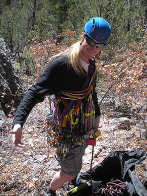
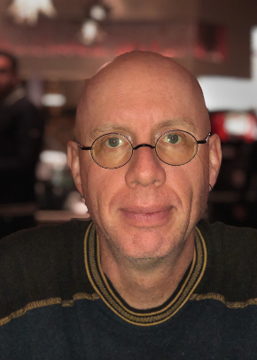
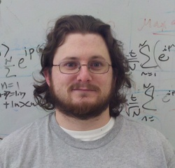

# Summer School Leads

### Christoph Junghans

CCS-7 Applied Computer Science

 Christoph is a computational physicist with a background in molecular dynamics and multi-scale physics applications. He also has experience in software engineering and task-based run-time systems. His interests lie in understanding modern computing architectures and the design of sustainable code.

### Robert Pavel

CCS-7 Applied Computer Science

Robert is a computational scientist with a background in electrical and computer engineering. He has experience in improving the performance of multi-scale physics applications through the use of task based models and NoSQL databases. His interests include evaluating the suitability of modern task based programming models with respect to scientific applications.

Robert is an alumnus of the 2013 and 2014 summer school classes!

# Summer School Mentors

### Irina Demeshko

CCS-7 Applied Computer Science

Irina is a computational scientist the Co-Design Team. Her current research work is currently focused on integrating task-based run-time systems into several software projects at LANL, but, in general, her research interests lay around new HPC technologies in application to large-scale scientific simulation codes.

### Patricia (Pat) Grubel

CCS-7 Applied Computer Science

Pat is a postdoctoral research associate in the Co-design Team. She has a background in electrical and computer engineering, future architectures, and performance analysis of task basked runtime systems.  Her current interests lie in modeling and performance optimization of applications using task based systems, cloud computing technologies, and benchmarking new architectures.

### David Gunter

CCS-7 Applied Computer Science

David is former computational physicist working in the fields of condensed matter and electromagnetic computations. He now devotes his time to exploring novel algorithms, architectures, and programming models to help solve some of LANL's most pressing computational needs. He is a member of the IC Application Performance Team as well as the Future Architectures Team within CCS-7.

### Chris Malone

XCP-1 Lagrangian Applications

Chris is a computational scientist with a background in astrophysics. In particular, his interests lie in numerical modelling of astrophysical explosions driven by turbulent flow coupled to thermonuclear reactions, such as Type Ia supernovae and Type I X-ray bursts.  In recent years, his focus has been on high-energy physics in general, with applications and development on modern computing architectures.

### Marc Charest

XCP-1 Lagrangian Applications

Marc's current research focuses on developing highly-scalable algorithms for multi-material and multi-physics problems that are specifically designed for next-generation computer architectures.  More specifically, he is developing/implementing advanced remapping strategies for arbitrary polygonal meshes.  Prior research at LANL focused on developing high-order methods for Eulerian and ALE hydrodynamics that can be used in conjunction with adaptive mesh refinement and unstructured grids.
